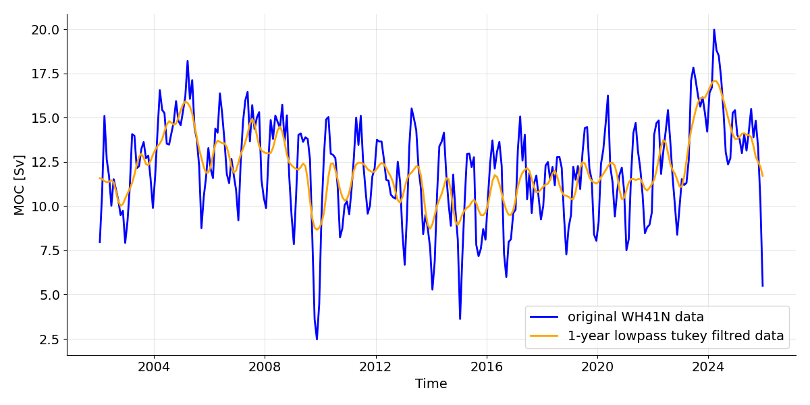

# Characterising an AMOC time series
Course: 
&emsp;&emsp;Data Analysis for Physical Oceanography (MSc)
Name:
&emsp;&emsp;Arved Lattekamp
Dataset:
&emsp;&emsp;WH41N

## The Dataset
The dataset WH41N is an estimate of the Atlantic Merioional Overturning Circulation derived using ARGO and Altimetry observations. The datasets covers monthly data from Jan 2002 until Dec 2025. There are nor gaps in the dataset (i.e. all month have a given transport). Therefore the total lenght of the dataset is 24yrs times 12 month &rarr; 288 datapoints. Given the fact that each monthly datapoint is mean over three month, this dataset is oversampled.
## Time domain characertization
To characterize the time domain of the time series, I firstly plotted the original time series and the time series with a 1-year lowpass tukey filter.
 
*Figure 1: Time series of WH41N data (blue) and lowpass tukey filtred data (orange)*