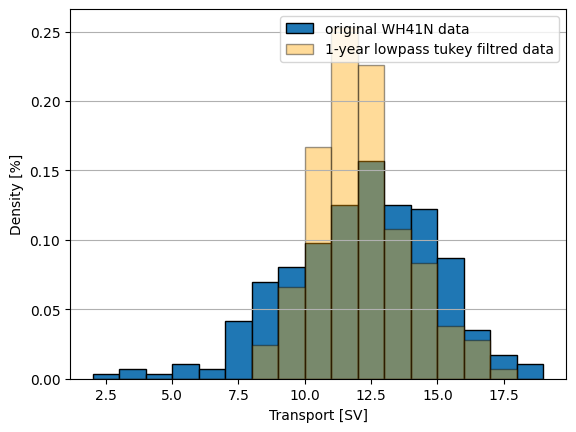
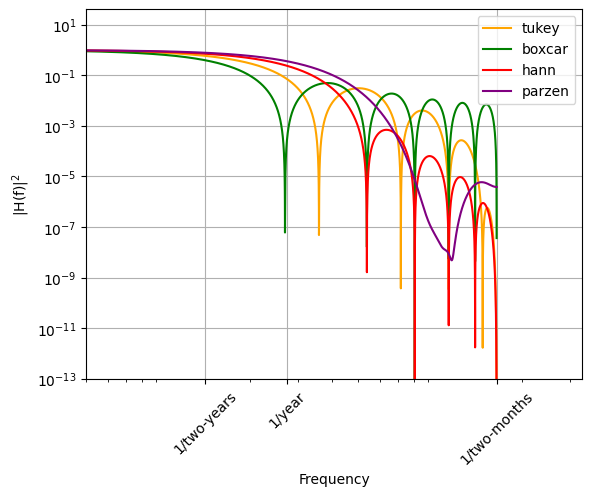
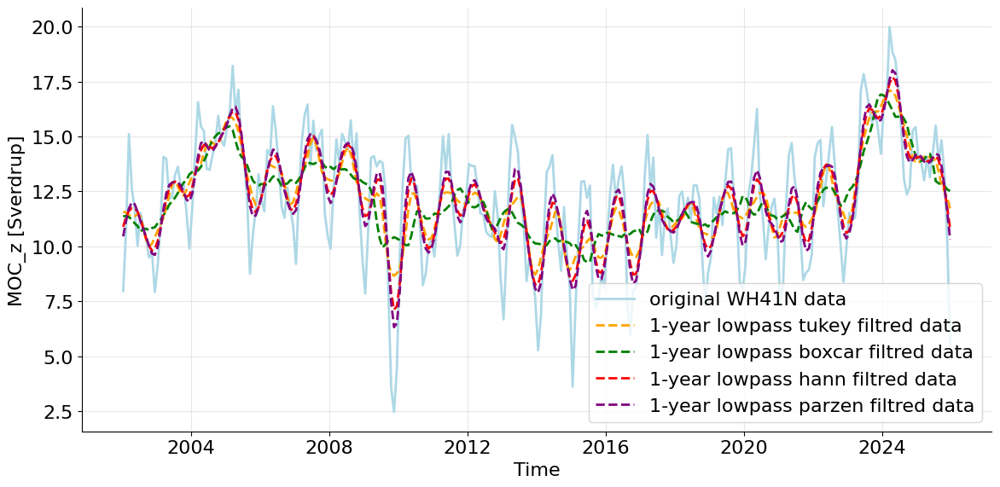

# Characterising an AMOC time series
Course:  
&emsp;&emsp;Data Analysis for Physical Oceanography (MSc) 
Name: 
&emsp;&emsp;Arved Lattekamp 
Dataset: 
&emsp;&emsp;WH41N 

## The Dataset
The dataset WH41N is an estimate of the Atlantic Merioional Overturning Circulation derived using ARGO and Altimetry observations. The datasets covers monthly data from Jan 2002 until Dec 2025. There are no gaps in the dataset (i.e. all month have a given transport). Therefore the total lenght of the dataset is 24yrs times 12 month &rarr; 288 datapoints. Given the fact that each monthly datapoint is mean over three month, this dataset is oversampled.
## Time domain characterization
  
*Figure 1: Time series of original WH41N data (blue) and lowpass tukey filtred data (orange).The greenish part shows the overlap between both histograms.*  
The time series (Figure 1) shows a distinct annual cycle. It fluctuates around a mean value of 12.14 Sv with a cycle of approximately 20 years. The time series deviates from this mean by a standard deviation of 2.81 Sv. Looking at the filtered time series, it is noticeable that, whilst it also shows an annual and a 20-year cycle, the amplitude of the peaks is significantly lower. The minimally shifted mean of this time series is 12.14 Sv. The standard deviation of the filtred time series is smaller due to the smaller amplitude and is 1.76 Sv.  
The total range over the 24 years in the original data is 17.51 Sv, with the minimum at 2.47 Sv and the maximum at 19.98 Sv. Logically, due to the lower amplitude, the range in the filtered time series is also smaller. The minimum here is 8.67 Sv and the maximum 17.09, so the range is 8.42 Sv.  
Those differences in mean and standardderviation can also be seen in the histograms of the time series (Figure 2). 
 
*Figure 2: Histograms of original WH41N data (blue) and lowpass tukey filtred data (orange)*  
## Frequency domain characterization
 
*Figure 3: Spectra of original WH41N data in grey (raw spectrum) and blue (welch spectrum) and lowpass tukey filtred data in orange (welch spectrum), with 95% confidence intervals for the welch spectra.  The raw spectrum is calculated using a fast furie transformation, while the welch spectra is calculated with a hann tapered overlapping window. The window has size of 12 n per segment, which translates to 10 years. Therefore my 24 year time series has roughly 5 windows. For the calculation of the confidence interval a chi-squared distribution was assumed.*  
The already mentioned distinct annual cycle  also shows up in the spectrum of my time series (Figure 3), with a peak at the 1/year frequency. The dominante frequency of 1/20-years does not show up in the spectrum. This is probably because the timeseries is to short to resolve this in the spectrum. The overall shape of the spectrum is red, but not clearly visible.  
The spectrum of the 1-year tukey filtred time series also shows a peak at a frequency of 1 per year. This peak is, because of the lower amplitude in the time domain, also lower in the frequency domain. After this peak an expected rolloff is visible. The frequencies faster than 1 per year are surpressed by the 1-year tukey filter.  
The raw spectrum resolves all frequencies and the parseval ratio is 0.999. This is different for the two welch spectra. The not filtred welch spectrum has a parseval ratio of 0.765, which is plausible du to supressed variations due to the tapering with the hann windows. I would assume a similar parseval ratio between the filtered time series and the welch spectrum for the filtred series, but this ratio only is 0.405. Seemingly filtering a filter surpresses even more variation then just filtering the original time series. 
## Justification of applied filter
In this analysis, I used a 1-year tukey filter on the data. I could have also used a boxcar, hann or parzen filter. All four filter have different frequnecy responses with different sidelobes (Figure 4). In this section I'll show the benefits of a tukey filter. 
 
*Figure 5: Frequency responses of a tukey (orange), boxcar (green), hann (red) and parzen (purple) filter.*  
Applying all four filters on the time series (Figure 5) shows, that the boxcar filter surpresses the annual cycle, whilst the parzen and the hann filter both do not surpress it signaficantly. The tukey filter, surpresses the strong variations in the annual cycle but keeps smaller variations. Therefore the overall trend can be analyzed better. 
 
*Figure 4: Time series of original WH41N data (light blue) and lowpass filtred data using different filters. The applied filters are: tukey (orange), boxcar (green), hann (red) and parzen (purple)*  
This also reflects in the different spectra (Figure 6)for, whilst no dominant frequency can be seen in the boxcar filtred spectrum, all other three filtred time series have a peak at a frequency of one per year.  
In summary, the tukey filter is the best choice, because it surpresses the dominant cylce in a way that it is still detectable but the long term trend is clearer. 
 
*Figure 6: Spectra of original WH41N data in grey (raw spectrum) and blue (welch spectrum) and lowpass tukey filtred data in orange (welch spectrum), with 95% confidence intervals for the welch spectra.  The welch spectra is calculated with a hann tapered overlapping window. The window has size of 12 n per segment, which translates to 10 years. Therefore my 24 year time series has roughly 5 windows. For the calculation of the confidence interval a chi-squared distribution was assumed.*  

## References
Willis, J. K., and Hobbs, W. R., Atlantic Meridional Overturning Circulation Near 41N from Altimetry and Argo Observations. Dataset access [2026-06-17] at [10.5281/zenodo.8170366](https://doi.org/10.5281/zenodo.8170366).