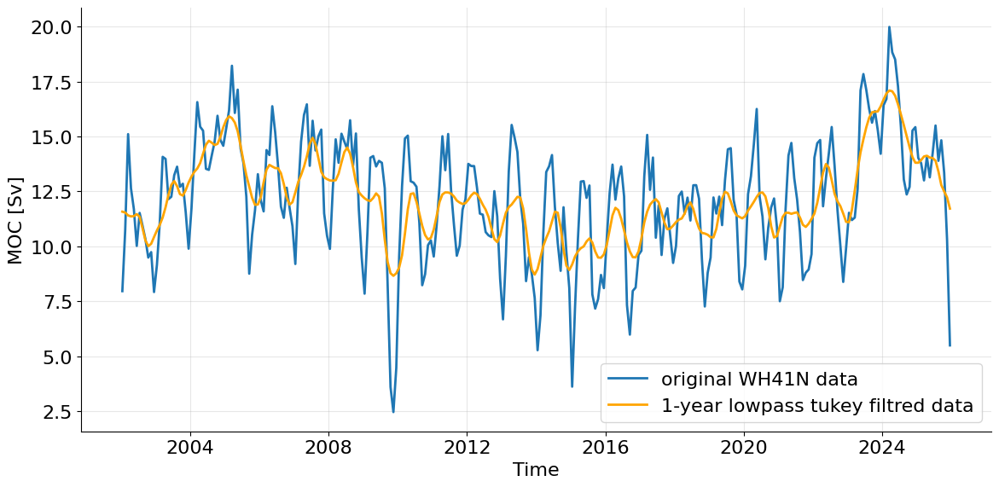
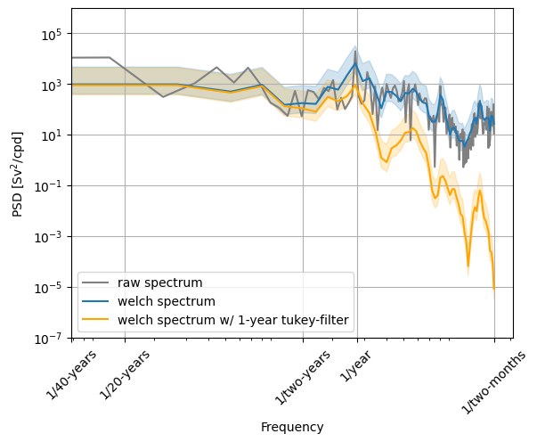
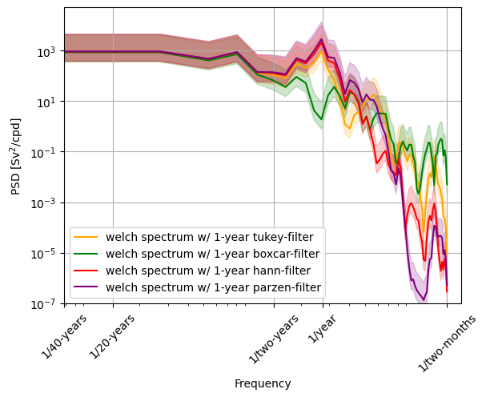

# Characterising an AMOC time series
Course:  
&emsp;&emsp;Data Analysis for Physical Oceanography (MSc) 
Name: 
&emsp;&emsp;Arved Lattekamp 
Dataset: 
&emsp;&emsp;WH41N Github Repository: 
&emsp;&emsp;[https://github.com/arvedlattekamp/arved-assignment1](https://github.com/arvedlattekamp/arved-assignment1)

## The Dataset
The dataset WH41N is an estimate of the Atlantic Meridional Overturning Circulation derived using ARGO and Altimetry observations. The datasets covers monthly data from Jan 2002 until Dec 2025. There are no gaps in the dataset (i.e. all months have a given transport). Therefore the total length of the dataset is 24 yrs times 12 months &rarr; 288 datapoints. Given the fact that each monthly datapoint is a mean over three months, this dataset is oversampled.
## Time domain characterization
  
*Figure 1: Time series of original WH41N data (blue) and lowpass Tukey filtered data (orange).*  
The time series (Figure 1) shows a distinct annual cycle. It fluctuates around a mean value of 12.14 Sv with a cycle of approximately 20 years. The time series deviates from this mean by a standard deviation of 2.81 Sv. Looking at the filtered time series, it is noticeable that, whilst it also shows an annual and a 20-year cycle, the amplitude of the peaks is significantly lower. The minimally shifted mean of this time series is 12.14 Sv. The standard deviation of the filtered time series is smaller due to the smaller amplitude and is 1.76 Sv.  
The total range over the 24 years in the original data is 17.51 Sv, with the minimum at 2.47 Sv and the maximum at 19.98 Sv. Logically, due to the lower amplitude, the range in the filtered time series is also smaller. The minimum here is 8.67 Sv and the maximum 17.09 Sv, so the range is 8.42 Sv.  
Those differences in mean and standard deviation can also be seen in the histograms of the time series (Figure 2). 
 
*Figure 2: Histograms of original WH41N data (blue) and lowpass Tukey filtered data (orange). The greenish part shows the overlap between both histograms.*  
## Frequency domain characterization
 
*Figure 3: Spectra of original WH41N data in grey (raw spectrum) and blue (welch spectrum) and lowpass Tukey filtered data in orange (welch spectrum), with 95% confidence intervals for the welch spectra.  The raw spectrum is calculated using a fast Fourier transformation, while the welch spectra are calculated with a Hann tapered overlapping window. The window has a size of 12 months per segment, which translates to 10 years. Therefore my 24-year time series has roughly 5 windows and 10 d.o.f.. For the calculation of the confidence interval a chi-squared distribution was assumed.*  
The already mentioned distinct annual cycle  also shows up in the spectrum of my time series (Figure 3), with a peak at the 1/year frequency. The --- in the time series visible frequency --- of 1/20-years does not show up in the spectrum. This is probably because the timeseries is too short to resolve this in the spectrum. The overall shape appears to be slightly red, though not clearly.  
The spectrum of the 1-year Tukey filtered time series also shows a peak at a frequency of 1 per year. This peak is, because of the lower amplitude in the time domain, also lower in the frequency domain. After this peak an expected rolloff is visible. The frequencies faster than 1 per year are suppressed by the 1-year Tukey filter.  
The raw spectrum resolves all frequencies and the Parseval ratio is 0.999. This is different for the two welch spectra. The not filtered welch spectrum has a Parseval ratio of 0.765, which is plausible due to supressed variations due to the tapering with the Hann windows. I would assume a similar Parseval ratio between the filtered time series and the welch spectrum for the filtered series, but this ratio only is 0.405. Seemingly filtering a filter suppresses even more variation then just filtering the original time series. 
## Justification of applied filter
In this analysis, I used a 1-year Tukey filter on the data. I could have also used a boxcar, Hann or Parzen filter. All four filter have different frequnecy responses with different sidelobes (Figure 4). In this section I will show the benefits of a Tukey filter. 
 
*Figure 4: Frequency responses of a Tukey (orange), boxcar (green), Hann (red) and Parzen (purple) filter.*  
Applying all four filters on the time series (Figure 5) shows, that the boxcar filter suppresses the annual cycle, whilst the Parzen and the Hann filter both do not suppress it significantly. The Tukey filter, suppresses the strong variations in the annual cycle but keeps smaller variations. Therefore the overall trend can be analyzed better. 
 
*Figure 5: Time series of original WH41N data (light blue) and lowpass filtered data using different filters. The applied filters are: Tukey (orange), boxcar (green), Hann (red) and Parzen (purple)*  
This is also reflected in the different spectra (Figure 6): while no dominant frequency can be seen in the boxcar-filtered spectrum, all three other filtered time series show a peak at a frequency of one per year.  
In summary, the Tukey filter is the best choice, because it suppresses the dominant cylce in a way that it is still detectable but the long term trend is clearer. 
 
*Figure 6: Spectra of original WH41N data in grey (raw spectrum) and blue (welch spectrum) and lowpass Tukey filtered data in orange (welch spectrum), with 95% confidence intervals for the welch spectra.  The welch spectra are calculated with a Hann tapered overlapping window. The window has size of 12 n per segment, which translates to 10 years. Therefore my 24 year time series has roughly 5 windows and 10 d.o.f.. For the calculation of the confidence interval a chi-squared distribution was assumed.*  

## References
Willis, J. K., and Hobbs, W. R., Atlantic Meridional Overturning Circulation Near 41N from Altimetry and Argo Observations. Dataset access [2026-06-17] at [10.5281/zenodo.8170366](https://doi.org/10.5281/zenodo.8170366).
