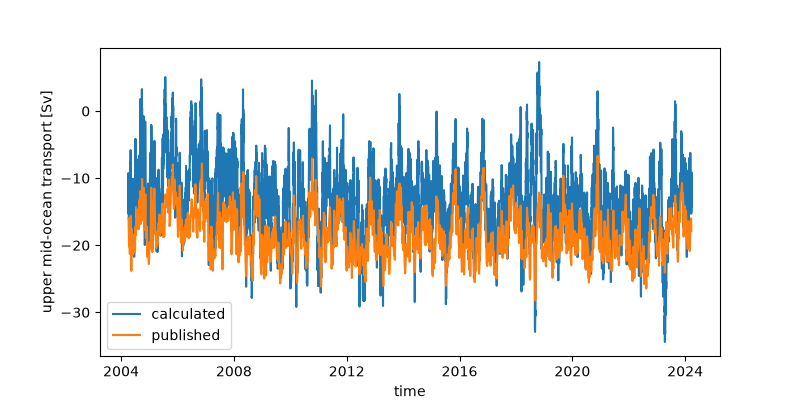
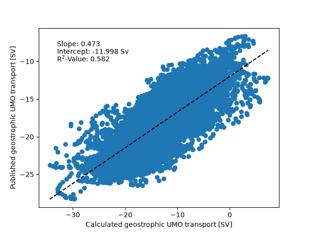
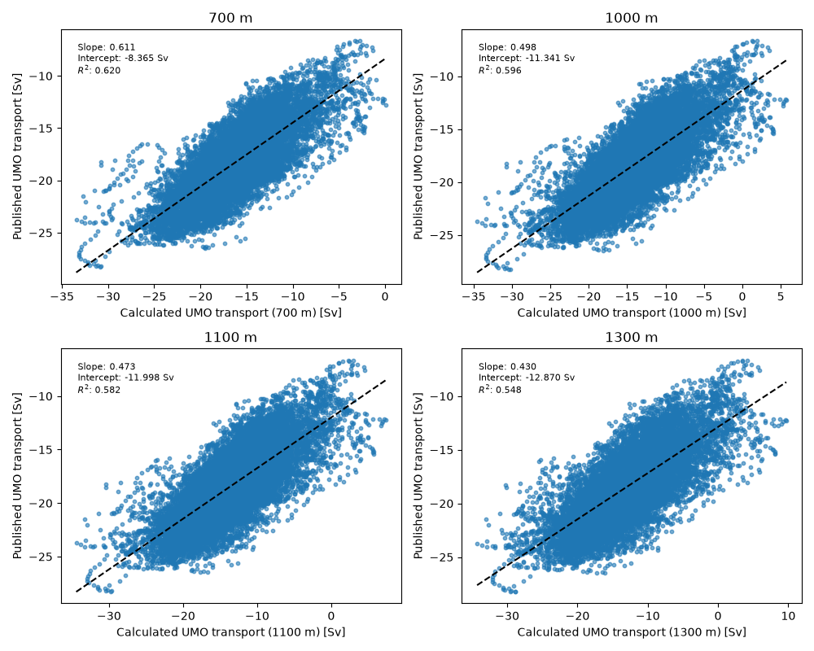
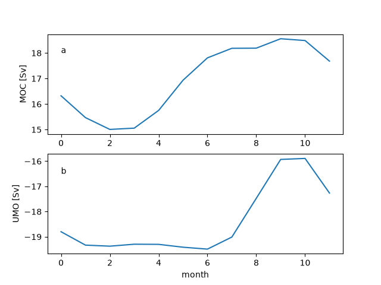
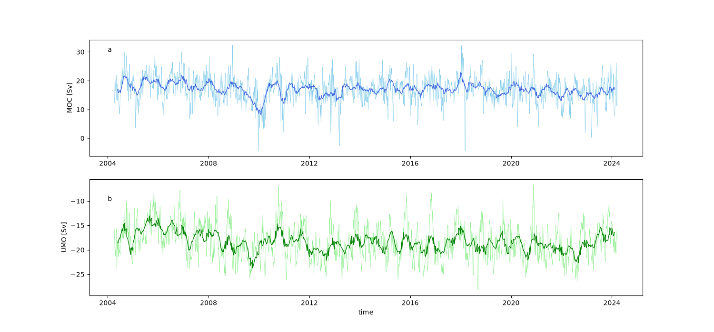
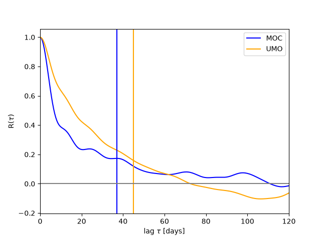
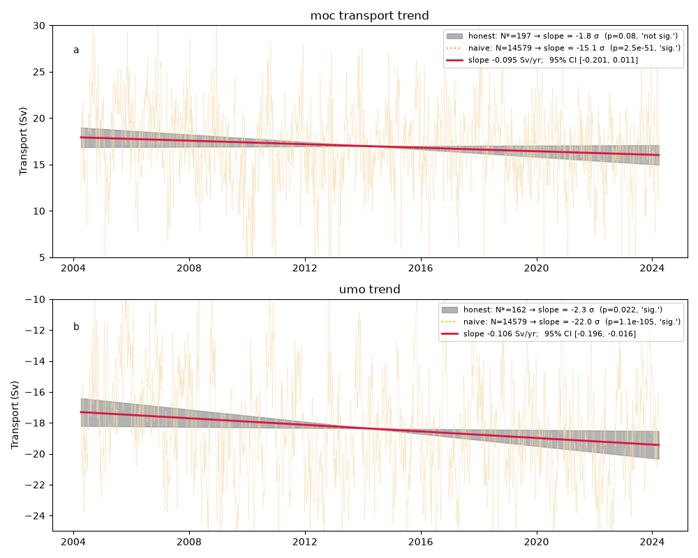
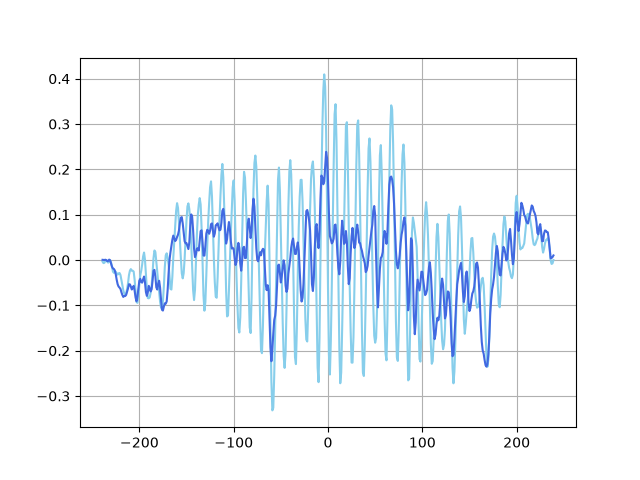
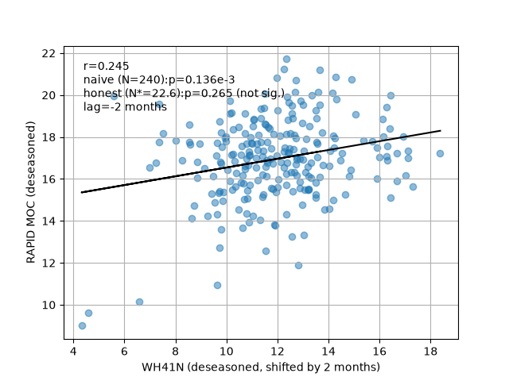

# Geostrophic transport and relating AMOC series

Course:  

&emsp;&emsp;Data Analysis for Physical Oceanography (MSc) 

Name: 

&emsp;&emsp;Arved Lattekamp 

Datasets: 

&emsp;&emsp;RAPID, WH41N 
 Github Repository: 

&emsp;&emsp;[https://github.com/arvedlattekamp/arved-assignment2](https://github.com/arvedlattekamp/arved-assignment2)

## Data
This assignment uses two different datasets from the amoc atlas.  The first one is the WH41N dataset by Willis and Hobbs.  The dataset is an estimate of the Atlantic Meridional Overturning Circulation derived using ARGO and Altimetry observations. The datasets covers monthly data from Jan 2002 until Dec 2025. There are no gaps in the dataset (i.e. all months have a given transport). Therefore the total length of the dataset is 24 yrs times 12 months → 288 datapoints. Given the fact that each monthly datapoint is a mean over three months, this dataset is oversampled. The dataset has the following variables with the given characteristics: 
| Variable | Description | Units | Size | Min Value | Max Value | Missing % |
|---|---|---|---|---:|---:|---:|
| *MOC (PW)* → **MHT** | **MHT**: Meridional Overturning Heat Transport | PW | (288,) | -0.04 | 0.94 | 0.0% |
| *MOC (Sv)* → **MOC** | **MOC_z**: Meridional Overturning Volume Transport | sverdrup | (288,) | 2.47 | 19.98 | 0.0% |
| *Ekman (Sv)* → **TRANS_EKMAN** | **Ekman**: Ekman Volume Transport | sverdrup | (288,) | -8.79 | 0.51 | 0.0% |
| *Geos (Sv)* → **TRANS_GEO** | **Geostrophic Transport**: Northward Geostrophic Transport | sverdrup | (288,) | 6.16 | 23.96 | 0.0% |

The second dataset is the RAPID dataset, from which I use the gridded temperature and salinity dataset (ts-gridded) and the meridional overturning transport dataset (moc).  The ts-gridded spans from april 2004 to march 2024. It uses the time and pressure (242 pressure levels) as coordinates and has in total 18 variables. The sampling frequency of the data is twice per day. Therefore the size of each variable array is (242,14599). I only use  the following variables: 
| Variable | Description | Units | Size | Min Value | Max Value | Missing % |
|---|---|---|---|---:|---:|---:|
| SG_east → PSAL_EAST | Salinity east 26.99N/16.23W | 1 | (242, 14599) | 34.89 | 36.96 | 0.8% |
| SG_west → PSAL_WEST | Salinity 26.52N/76.74W | 1 | (242, 14599) | 34.87 | 37.11 | 0.4% |
| TG_east → TEMP_EAST | Temperature east 26.99N/16.23W | degree_C | (242, 14599) | 2.36 | 23.74 | 0.8% |
| TG_west → TEMP_WEST | Temperature 26.52N/76.74W | degree_C | (242, 14599) | 2.16 | 29.23 | 0.4% |

The moc dataset has the same timespan and sampling frequency as the ts-gridded, but does not rely on pressure levels. It has in total 12 variables from which I use the following two: 
| Variable | Description | Units | Size | Min Value | Max Value | Missing % |
|---|---|---|---|---:|---:|---:|
| *moc_mar_hc10* → **MOC** | **MOC_z**: MOC strength | sverdrup | (14599,) | -4.35 | 32.34 | 0.1% |
| *t_umo10* → **TRANS_UMO** | **Upper mid-ocean**: Upper Mid-Ocean transport | sverdrup | (14599,) | -28.24 | -6.65 | 0.1% |

## Geostrophic Transport
In this section I'm going to first calculate the geostrophic transport, compare it against a published product and  test the sensitivity of the geostrophic transport against it's integration depth.
### Calculating geostrophic transport
To calculate the geostrophic transport of the upper mid-ocean, I used the dynamic height and the thermal wind equation and integrated over 1100 m depths, which is approximately the depth of the AMOC maximum. If I would have integrated over the whole depth the upper northward transport would more or less cancel out with the lower southward transport. Throughout, UMO transport is signed negative, following the RAPID convention where negative indicates the (dominant) southward-compensating component of the upper mid-ocean flow; a value "closer to zero" therefore corresponds to a weaker transport, not a larger one.
### Comparing geostrophic transport
If I compare the calculated geostrophic transport with the in the dataset published transport for the upper mid-ocean (UMO), differences in magnitude and standarddeviation of the transports can be seen. While the calculated transport has a mean of -13.456 Sv the published one is approximately 5 Sv more negative (stronger southward) with a mean of -18.368 Sv. Also the variance is much stronger in the calculated products with 5.5 Sv against 3.4 Sv (Figure 1). 
 

*Figure 1: Time series of the calculated UMO (blue) and the published one (orange) .*  

The correlation between the two products is visible and has a weak R$^2$ of 0.582. The slope is 0.473 and the intercept is at -11.998 Sv (Figure 2). This is showing again that the calculated product overestimates the results and has a lot more variance than the published one, which makes it more sensitive to changes and therefore has a quite small slope of 0.473. 
This extra variance likely comes from physics my calculation can't capture. Thermal wind only gives the baroclinic part of the transport (the part driven by density differences relative to my chosen reference level) — it can't recover the barotropic part. RAPID gets this barotropic part from bottom-pressure measurements at each mooring plus a mass-balance constraint across 26°N, which I don't have. Without it, real barotropic fluctuations just show up as noise in my series, which increases the variance without increasing the correlation. A second reason is that RAPID splits the calculation into western and eastern basins at the Mid-Atlantic Ridge, each with its own reference level, while I use one single west-to-east difference. 
 

*Figure 2: Correlation of the calculated UMO (blue) and the published one (orange).*  
 
 
### Sensitivity Against Integration Depths (Part 3)
To test how sensitive the calculated transport is against its integration depth, I calculated the transport for different depths (700 m, 1000 m, 1100 m, 1300 m) 
| Integration depth | Mean (Sv) | Std (Sv) | 
|---|---|---|
| 700 m | -16.375105 | 4.401429 | 
| 1000 m | -14.107682 | 5.290731 |
| 1100 m | -13.455614 | 5.501137 |
| 1300 m | -12.775780 | 5.874200 |

The mean and the standard deviations of the calculated transports show that with decreasing the integration depths an increase in mean transport is achieved therefore the calculated transport with an integration depths of 700 m is closest to the published product. If I correlate each transport with the published product a similar picture can be drawn. The R$^2$-Value increases with decreasing integration depth. At the same point the intercept is approaching 0 with decrease of the integration depth and the slope approaches 1 (Figure 3). 

 

*Figure 3: Correlations of the calculated UMO (blue) and the published one (orange) . For each correlation a different integrations depths was chosen.*  

## Evaluating Time Series
In this section I'm first going to evaluate two single time series (UMO and MOC) and look at their seasonal cycle,  autocorrelation and trends. Afterwords I'm going to look at the cross correlation between 26°N and 41°N.
### Seasonal Cycle
 

*Figure 4: Seasonal cycles of the  MOC (a) and the UMO (b).*  
The seasonal cycles of the MOC and the UMO (Figure 4) both are apparent. While the MOC shows a sinusoidal curve with the minimum transport in february/march (~15 Sv) and its maximum in september (~18.5  Sv), instead the seasonal cycle of the UMO also has its minimum in spring with around -19 Sv from january to june and its minimum in september/October with around -16 Sv. In both cases the seasonal cycle has a magnitude of around 3.5 Sv which is similar to the variance of the published UMO product. The deseasoned timeseries also shows a similar picture. Even though the seasonal cycle is removed, the curvature of the deseasoned (thick) timeseries still follows roughly the raw (thin) timeseries (Figure 5). 
 

*Figure 5: Deseasoned timeseries of the  MOC (a) and the UMO (b). The thick line shows the deseasoned timeseries, while the thin line shows the raw timeseries*  
### Autocorrelation 
The integral timescale of those two timeseries can be detected using the autocorrelation (Figure 6). The MOC has a slightly shorter memory with a integral timescale of around 37 samples or 18.5 days, the UMO has a slightly longer memory with an integral timescale of 45 samples or 22.5 days. This means the memory of those two timescales is around two to three weeks (Figure 6). 
 

*Figure 6: Autocorrelation of the  MOC (blue) and the UMO (orange). The vertical lines show the integral timescale in days.*  

### Trends
Using the integration timescale the number of effective can be calculated with $N*=N/(2\cdot T^*)$ which leads to 197 effective samples for the MOC and 162 effective samples for the UMO. Using those effective samples we can check if the trend is still significant with the reduced but honest number of samples (Figure 7). The MOC shows a trend if all data points are used but looking only at the 197 independent realisations, the slope is -1.8$\sigma$ and not significant anymore. This is different for the UMO. The UMO is significant using all data points and using only the independent ones. This means that a change in the UMO can be observed.  
 

*Figure 7: Honest and naive trend of the  MOC (a) and the UMO (b). The red line shows the trend while the gray shading shows the confidence interval of the honest estimate. In light orange the raw timeseries is shown.*  
### Matching WH41N and RAPID
WH41N is a monthly product where each value is a 3-month running mean, while RAPID is sampled twice daily. Before cross-correlating, the RAPID series was  low-pass filtered to a 3-month window so both series carry comparable temporal resolution. In a second step I regridded the RAPID  data to the 1st of each month to fit the WH41N data.
### Cross correlation
 

*Figure 8: Cross-correlation between WH41N and RAPID. The deseasoned cross-correlation is shown in dark blue, while the raw cross-correlation is shown in light blue.*  
If I cross correlate the deseasoned 41°N timeseries with the 26°N, I obtain a peak lag at -2 months with a correlation of r = 0.245 (Figure 8), which means that the signal needs 2 months to get from 41°N to 26°N. Here a positive lag means WH41N leads RAPID, so -2 months means WH41N leads RAPID by 2 months. This matches the expectation that the signal is transported from the poles to the equator.

To check if this correlation is actually meaningful and not just because both series are persistent, I calculate the effective number of independent samples using the integral timescales of both series (5.73 months for WH41N, 4.91 months for RAPID), which gives N* ≈ 22.6 out of the 240 matched monthly samples. Without this reduced sample size, the correlation of r = 0.245 gives a p-value of $1.36\times 10^{-4}$. With the reduced sample size p = 0.265, which is not significant at the 95% level. This shows that although the lag of -2 months matches the physical expectation of signal propagation from the subpolar North Atlantic to 26°N, the correlation itself is too weak given how few independent samples the persistence of both series leaves us with — the result should be seen as only suggestive, not a confirmed lead-lag relationship (Figure 9).
 

*Figure 9: Correlation between WH41N and RAPID with a lag of 2 months.*  

## References
Willis, J. K., and Hobbs, W. R., Atlantic Meridional Overturning Circulation Near 41N from Altimetry and Argo Observations. Dataset access [2026-09-01] at [10.5281/zenodo.8170366](https://doi.org/10.5281/zenodo.8170366).

Moat B.I.; Smeed D.; Rayner D.; Johns W.E.; Smith R.H.; Volkov D.L.; Elipot S.; Petit T.; Kajtar J.B.; Baringer M.O.; Collins J.(2026). Atlantic meridional overturning circulation observed by the RAPID-MOCHA-WBTS (RAPID-Meridional Overturning Circulation and Heatflux Array-Western Boundary Time Series) array at 26N from 2004 to 2024 (v2024.1a). NERC EDS British Oceanographic Data Centre NOC. Dataset access [2026-09-01] at [10.5285/48d0bf43-0598-ceb2-e063-7086abc062f1](https://doi.org/10.5285/48d0bf43-0598-ceb2-e063-7086abc062f1).
